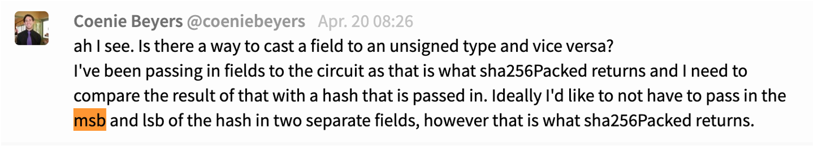

# zokrates-js with React (very basic) demo

Based on the [Truffle React box](https://www.trufflesuite.com/boxes/react).

## Initial remark

For getting into 'standard' zokrates (without the js-part), I recommend (both slightly older, but a good starting point; the file extension for Zokrates files has changed from `.code` to `.zok`, for example):
- this [article](https://blog.gnosis.pm/getting-started-with-zksnarks-zokrates-61e4f8e66bcc)
- also this [tutorial](https://medium.com/zokrates/building-identity-linked-zksnarks-with-zokrates-a36085cdd40) from TUB pride Jacob Eberhardt
- as well as this [tutorial](https://github.com/leanthebean/puzzle-hunt) - note that the syntax is slightly outdated; instead of `x * y + 4 == 10` you would now use `assert(x * y + 4 == 10)`.

## Set-up

### Required

- npm 7.12.1
- node v14.16.1
- truffle v5.3.4

(Using slightly outdated versions on purpose to avoid the node-gyp error appearing on MacOS. Normally, C++ support is included in the XCode command line tools, however I keep getting the node-gyp error occasionally and downgrading tools usually helps. On Windows, the Visual Studio C++ redistributable can help apparently. On Linux ... so some of your `Pacman` magic dude)

Install node packages from package-lock.json in top level directory as well as client.

### Important adaptation of the truffle React box for using zokrates-js

Zokrates is written in Rust. In order to use code written in one of the C family of languages (C, C++, Rust) in a frontend, it needs to be bundled using [WebAssembly](https://developer.mozilla.org/en-US/docs/WebAssembly). The Truffle React box includes Webpack; however, in order for zokrates-js to work the following additional steps **had** to be carried out in the `client` subdirectory (you don't need to do any of this now as the setup should already be correct, just for the record):

1) Run `npm install --save-dev react-app-rewired wasm-loader`
2) Add a new file `config-overrides.js` with the following content:

```
const path = require('path')

module.exports = function override (config, env) {
  const wasmExtensionRegExp = /\.wasm$/
  config.resolve.extensions.push('.wasm')
  config.module.rules.forEach(rule => {
    (rule.oneOf || []).forEach(oneOf => {
      if (oneOf.loader && oneOf.loader.indexOf('file-loader') >= 0) {
        oneOf.exclude.push(wasmExtensionRegExp)
      }
    })
  })

  config.module.rules.push({
    test: wasmExtensionRegExp,
    include: path.resolve(__dirname, 'src'),
    use: [{ loader: require.resolve('wasm-loader'), options: {} }]
  })

  return config
}
```
3. In `package.json`, change `react-scripts start` to `react-app-rewired start`:
```
"start": "react-app-rewired start",
````

(These instructions are taken from [here](https://github.com/matter-labs/zksync/issues/238)).

### Remark

I'm not entirely sure if it is necessary to have Rust installed locally in order to use `zokrates-js`. If something isn't working, try setting up rust like in the image shown below (this should approximately be what to do, in case that isn't working the screenshot at least gives clues regarding what specifically is required, however the exact commands might be outdated and the tools may have to be acquired from different sources 😬)


### How to work with `zokrates-js` (approximately) (I think) (at least from what I gather)

After the setup pain described above was completed, I mostly followed the (sparse) [documentation](https://zokrates.github.io/toolbox/zokrates_js.html) for `zokrates-js`.

For those who (like me) have no experience with React, my initial understanding is that it is somehow object-oriented, where parts of the UI are represented as components encapsulating functionality and data. When starting off, I just adapted the one component that was already contained in the truffle react box and added `zokratesProvider`, `artifacts`, `keypair` and `result` to that component's state (the state contains the data associated with this component in the form of key-value pairs). 

When using `zokrates-js`, the actual zokrates code has to be provided as a String. 

## Writing some Zokrates proofs

### (a) Hashing

When hashing in a 'normal' environment, steps are usually pretty straightforward - e.g., a sha256 hash in Python:

```
from Crypto.Hash import SHA256

hash_result = SHA256.new(data=(str(header) + str(nonce)).encode()).hexdigest() 
```

When using Zokrates, we have to venture deeper into the machinery. There are a multitude of strategies even just for SHA256 (which isn't the only type of hash supported by ZoKrates); we'll look at two.

Firstly, the [documentation](https://zokrates.github.io/examples/sha256example.html) as well as [this tutorial by master Jacob](https://medium.com/zokrates/building-identity-linked-zksnarks-with-zokrates-a36085cdd40) use the following approach:

```
import "hashes/sha256/512bitPacked.zok" as sha256

def main(private field i, private field j) -> (field[2]):
    field[4] hashMe = [0,0,i,j]
    return sha256(hashMe)'
```

Let's dissect.
- `private`: this means a value passed to the function remains secret (*zero knowledge!!*)
- `field`: according to the official documentation, `field` is 'the most basic type in ZoKrates, and it represents a field element with positive integer values in `[0,p-1]` where `p` is a (large) primary number. (...) While `field` values mostly behave like unsigned integers, one should keep in mind that they overlflow at `p` and not some power of 2.'.
- sha256 in the 512bitPacked-version accepts 512 bits of input to SHA156; however, a `field` value can only hold 254 bits due to the size of the underlying prime field used by ZoKrates. As a consequence, the input consists in four field elements, each one encoding 128 bits. These four elements are then concatenated in ZoKrates and passed to 256. Given that the resulting hash is 256 bit long, we split it in two and return each value as a 128 bit number. (again, from [the documentation](https://zokrates.github.io/examples/sha256example.html).)
- So far so good, but what exactly is it that is being returned and how to get it into the format we usually expected from a hash function (some long hex string)?? Unfortunately, the documentation only speaks of 'concatenating the outputs as 128 bit numbers'. However, for the example output in the documentation

```
~out_0 263561599766550617289250058199814760685
~out_1 65303172752238645975888084098459749904
```

this (hex'ing the concatenated two outputs)

```
hex(26356159976655061728925005819981476068565303172752238645975888084098459749904)
```

doesn't deliver the right result (`0x3a450ed2f069401c052899bcfe734f181a0f0d4f1b93f7225bd2afeae059ce10`, when it should be `0xc6481e22c5ff4164af680b8cfaa5e8ed3120eeff89c4f307c4a6faaae059ce10`).

- Another hint comes from the [ZoKrates Gitter](https://gitter.im/ZoKrates/Lobby):



- Unfortunately, I am too much of a Computer Engineering n00b to take it from there, maybe my group mates can help??

Okay, second approach. This was all derived from [this repo](https://github.com/robmuth/proof-of-work), coincidentally apparently the product of a group project of our lab teacher.
Unfortunately, the repo is already 3 years old so some of the syntax has changed (how couldn't it have).

```
import "utils/pack/u32/nonStrictUnpack256" as unpack256u
import "utils/pack/u32/pack256.zok" as pack256u
import "hashes/sha256/512bit" as sha256 \n'
  def main(private field nonce, private field bid) -> (field):
  u32[8] unpacked_nonce = unpack256u(nonce)
  u32[8] unpacked_bid = unpack256u(bid)
  u32[8] computed_hash = sha256(unpacked_bid,unpacked_nonce)
  field packed_hash = pack256u(computed_hash)
  return packed_hash';
```

This version of sha256 accepts two 32 bit unsigned integer arrays of size 8 each (8*32 = 256) and returns a field - seemingly (!) easier to work with.

Again, a decomposition.
- The `field` type inputs of `main`need to be `unpacked` into the aforementioned arrays of unsigned 32 bit integers (essentially, this gives operation gives us a byte representation). 
- What does a returned value look like? That would be `10819523912026123283071127282783392580738412155275342519290375065070496968228` (`0x17eba22e6b831b40258552b172bf5b4a86b22ff8a2271a5bac73e14aca48ee24` in hex according to Python).

Aside from the fact that is takes a really, really long time to carry out hashing using zokrates-js (due to WebAssembly?) - and not just when using this version of sha256, also when using the one mentioned first - the apparent problem here is: how do we calculate a hash to use as an input for ZoKrates when determining a hash collision (that's our ultimate goal)?

The [project](https://github.com/robmuth/proof-of-work/blob/master/bin/terminal.py) used as a reference here uses Python and [zokrates_pycrypto](https://github.com/Zokrates/pycrypto) for this purpose. `zokrates_pycrypto` offers a function called `to_bytes` to allow for the `unpacking` into bytes. Unfortunately, I can't get `pycrypto_zokrates` to work due to a `circular import` error ....


Note to self: use these
- https://github.com/Zokrates/ZoKrates/tree/latest/zokrates_stdlib/stdlib/utils/casts
- https://github.com/robmuth/proof-of-work/blob/master/zokrates/pow.code
