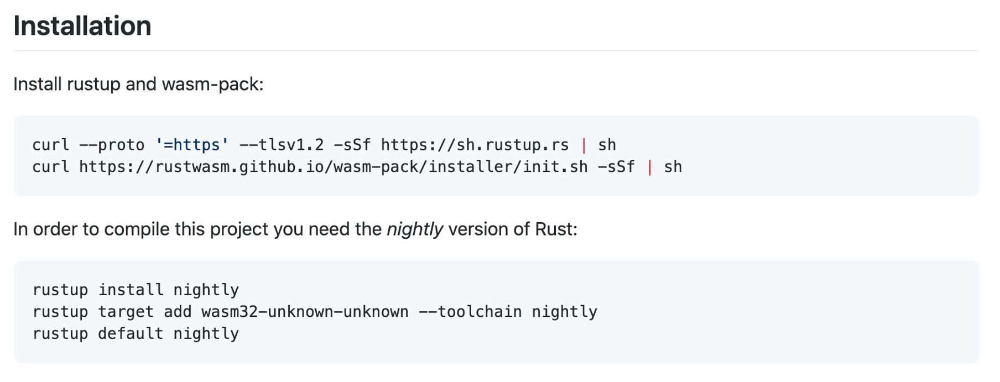

# zokrates-js with React (very basic) demo

Based on the [Truffle React box](https://www.trufflesuite.com/boxes/react).

## Initial remark

For getting into 'standard' zokrates (without the js-part), I recommend (both slightly older, but a good starting point; the file extension for Zokrates files has changed from `.code` to `.zok`, for example):
- this [article](https://blog.gnosis.pm/getting-started-with-zksnarks-zokrates-61e4f8e66bcc)
- as well as this [tutorial](https://github.com/leanthebean/puzzle-hunt) - note that the syntax is slightly outdated; instead of `x * y + 4 == 10` you would now use `assert(x * y + 4 == 10)`.

## Set-up

### Required

- npm 7.12.1
- node v14.16.1
- truffle v5.3.4

(Using slightly outdated versions on purpose to avoid the node-gyp error appearing on MacOS. Normally, C++ support is included in the XCode command line tools, however I keep getting the node-gyp error occasionally and downgrading tools usually helps. On Windows, the Visual Studio C++ redistributable can help apparently. On Linux ... so some of your `Pacman` magic dude)

Install node packages from package-lock.json in top level directory as well as client.

### Important adaptation of the truffle React box for using zokrates-js

Zokrates is written in Rust. In order to use code written in one of the C family of languages (C, C++, Rust) in a frontend, it needs to be bundled using [WebAssembly](https://developer.mozilla.org/en-US/docs/WebAssembly). The Truffle React box includes Webpack; however, in order for zokrates-js to work the following additional steps **had** to be carried out in the `client` subdirectory (you don't need to do any of this now as the setup should already be correct, just for the record):

1) Run `npm install --save-dev react-app-rewired wasm-loader`
2) Add a new file `config-overrides.js` with the following content:

```
const path = require('path')

module.exports = function override (config, env) {
  const wasmExtensionRegExp = /\.wasm$/
  config.resolve.extensions.push('.wasm')
  config.module.rules.forEach(rule => {
    (rule.oneOf || []).forEach(oneOf => {
      if (oneOf.loader && oneOf.loader.indexOf('file-loader') >= 0) {
        oneOf.exclude.push(wasmExtensionRegExp)
      }
    })
  })

  config.module.rules.push({
    test: wasmExtensionRegExp,
    include: path.resolve(__dirname, 'src'),
    use: [{ loader: require.resolve('wasm-loader'), options: {} }]
  })

  return config
}
```
3. In `package.json`, change `react-scripts start` to `react-app-rewired start`:
```
"start": "react-app-rewired start",
````

(These instructions are taken from [here](https://github.com/matter-labs/zksync/issues/238)).

### Remark

I'm not entirely sure if it is necessary to have Rust installed locally in order to use `zokrates-js`. If something isn't working, try setting up rust like in the image shown below (this should approximately be what to do, in case that isn't working the screenshot at least gives clues regarding what specifically is required, however the exact commands might be outdated and the tools may have to be acquired from different sources 😬)



### How to work with `zokrates-js` (approximately) (I think) (at least from what I gather)

After the setup pain described above was completed, I mostly followed the (sparse) [documentation](https://zokrates.github.io/toolbox/zokrates_js.html) for `zokrates-js`.

For those who (like me) have no experience with React, my initial understanding is that it is somehow object-oriented, where parts of the UI are represented as components encapsulating functionality and data. When starting off, I just adapted the one component that was already contained in the truffle react box and added `zokratesProvider`, `artifacts`, `keypair` and `result` to that component's state (the state contains the data associated with this component in the form of key-value pairs). 

When using `zokrates-js`, the actual zokrates code has to be provided as a String. 